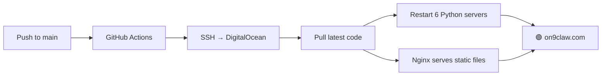

<p align="center">
  
</p>

<h1 align="center">╔══ PARKLAN CLAWHUB ══╗</h1>
<p align="center"><em>Retro-futuristic AI toolkit — one server, many machines.</em></p>

<p align="center">
  <a href="https://on9claw.com"></a>
  <a href="https://github.com/parklan/ClawProject/actions"></a>
  
  
</p>

<p align="center">
  
  
  
  
</p>

---

<!-- ──────────────────────────────────────────────────────────────── -->
<!--   TRANSPORT                                                       -->
<!-- ──────────────────────────────────────────────────────────────── -->

<h3 align="center">🚏 TRANSPORT & COMMUTE</h3>

| Project | Status | What it does | Tech |
|---------|:------:|--------------|------|
| **[Bus ETA](722-eta/)** — 巴膠仔 | `✅ Ready` | Real-time KMB + Citybus arrival checker. Route/stop search, joint-route merging, bookmarked stops with live countdown. Built-in Cantonese AI chatbot for bus routes. | `Python` `data.gov.hk API` `OpenRouter` |
| **[Parking Monitor](parking-monitor/)** | `🚀 Ready` | Live parking slot availability at Heung Yuen Wai (香園圍) border — per vehicle type, with booking window display. | `Python` `hywparking API` |

---

<!-- ──────────────────────────────────────────────────────────────── -->
<!--   FINANCIAL / MARKETS                                             -->
<!-- ──────────────────────────────────────────────────────────────── -->

<h3 align="center">📈 FINANCIAL & MARKETS</h3>

| Project | Status | What it does | Tech |
|---------|:------:|--------------|------|
| **[AI Stock Report](stock-report/)** — 投資報告 | `🚀 POC` | AI Cantonese investment analysis. Autocomplete ticker search → fundamentals + technicals (MA, RSI, PE, EPS) → full AI report with buy/hold/sell score. | `yfinance` `OpenRouter` `Python` |
| **[US Market Radar](us-market-radar/)** | `🧪 Beta` | US index dashboard: SPY, QQQ, DIA, IWM, VIX + open monitor. Real-time quotes from Yahoo Finance, updated via cron. | `yfinance` `Python` `JSON` |
| **[BTC 5m Strategy Lab](btc-5m-strategy-lab/)** | `🧪 Beta` | Paper-trade 5-minute BTC prediction markets. Strategy builder → break-even math → simulated trade journal. No real orders. | `Vanilla JS` `Polymarket` |
| **[Polymarket Execution](polymarket-execution/)** | `🔒 Private` | Private Polymarket execution staging. Wallet auth, risk controls (stake cap, loss limit, kill-switch), log panel. Live auto-trading **disabled**. | `Vanilla JS` `CLOB API` |

---

<!-- ──────────────────────────────────────────────────────────────── -->
<!--   AI & PRODUCTIVITY                                               -->
<!-- ──────────────────────────────────────────────────────────────── -->

<h3 align="center">🧠 AI & PRODUCTIVITY</h3>

| Project | Status | What it does | Tech |
|---------|:------:|--------------|------|
| **[QuickNotes](quicknotes/)** | `✅ Ready` | Capture notes via Signal → AI auto-categorizes, tags, summarizes. Searchable timeline dashboard with smart reminder detection. | `Flask` `Signal` `OpenClaw` |
| **[Ebook Canto Narration](ebook-canto-poc/)** | `🧪 Beta` | EPUB / text → AI Cantonese rewriting → spoken narration with emotion tags. Proof-of-concept demo. | `MiniMax API` `TTS` `Python` |

---

<!-- ──────────────────────────────────────────────────────────────── -->
<!--   OFFICE & SOCIAL                                                 -->
<!-- ──────────────────────────────────────────────────────────────── -->

<h3 align="center">🧋 OFFICE & SOCIAL</h3>

| Project | Status | What it does | Tech |
|---------|:------:|--------------|------|
| **[Tea Treat](tea-treat/)** — 請食 Tea | `🚀 POC` | Office tea ordering engine. Generate shareable link → scrape Foodpanda / Keeta menus → colleagues pick → auto-consolidate master order. | `Python` `SQLite` `Playwright` |
| **[Lunch Wallet](lunch-wallet/)** | `🔒 Private` | Shared group lunch expense tracker. Multi-member balances, per-person expense entry, owe/settlement summaries. Password-protected. | `Vanilla JS` `localStorage` |

---

<!-- ──────────────────────────────────────────────────────────────── -->
<!--   ENTERTAINMENT                                                   -->
<!-- ──────────────────────────────────────────────────────────────── -->

<h3 align="center">🎵 ENTERTAINMENT</h3>

| Project | Status | What it does | Tech |
|---------|:------:|--------------|------|
| **[Spotify AI Dashboard](spotify-dashboard/)** | `🧪 Beta` | Polished now-playing panel with album art, device list, queue preview. Play/skip/search behind access code. | `Spotify Web API` `OAuth` `Python` |
| **[跳一跳 Jump Jump](jumpjump/)** — 跳一跳 | `✅ Ready` | 蓄力跳躍休閒遊戲。Canvas 2D 等距投影，撳住蓄力放手跳，中心命中連擊加倍。Web Audio 合成音效、PWA 可安裝。核心邏輯 Rust→WASM（含 JS fallback）。 | `Canvas 2D` `Rust` `WebAssembly` `Web Audio` `PWA` |

---

<!-- ──────────────────────────────────────────────────────────────── -->
<!--   PRICE TRACKING                                                  -->
<!-- ──────────────────────────────────────────────────────────────── -->

<h3 align="center">✈️ PRICE TRACKING</h3>

| Project | Status | What it does | Tech |
|---------|:------:|--------------|------|
| **[HKExpress Scanner](hkexpress-price-scanner/)** | `🚀 Ready` | Automated flight price scanner. Configurable routes, Playwright scraping, SQLite history, Telegram/email alerts, auto-generated HTML report. | `Playwright` `SQLite` `APScheduler` |

---

## 🏗 ARCHITECTURE

```
on9claw.com (Nginx)
├── /                     → index.html (landing page)
├── /722-eta/             → Bus ETA app
├── /stock-report/        → AI stock report
├── /us-market-radar/     → US market dashboard
├── /btc-5m-strategy-lab/ → BTC strategy lab
├── /polymarket-execution/→ Polymarket dashboard
├── /quicknotes/          → QuickNotes app
├── /spotify-dashboard/   → Spotify control panel
├── /ebook-canto-poc/     → Cantonese narration demo
├── /tea-treat/           → Tea ordering engine
├── /parking-monitor/     → Parking availability
├── /lunch-wallet/        → Lunch wallet (🔒)
│
├── :8766  private_lunch_server.py       🔒 Lunch wallet auth gateway
├── :8767  spotify_dashboard_server.py   🎵 Spotify OAuth proxy
├── :8768  chatbot_server.py             💬 Laura chatbot (MiMo)
├── :8769  btc_strategy_server.py        📊 Polymarket BTC data proxy
├── :8770  stock_report_server.py        📈 Stock report AI engine
├── :5000  eta_proxy.py                  🚌 Bus ETA API proxy
└── cron   us-market-radar/update-quotes.py   📊 US quotes fetcher
```

---

## ⚡ DEPLOYMENT



Push to `main` triggers `.github/workflows/deploy.yml` — zero downtime, continuous delivery.

---

## ⚠️ DISCLAIMER

Financial tools (stock report, BTC lab, Polymarket execution) are **educational / paper-trading only**. Nothing here constitutes investment advice. Private projects are access-controlled and require authentication.

---

<p align="center">
  <sub>Built with 🦞 by Parklan · powered by <a href="https://openclaw.ai">OpenClaw</a></sub>
</p>
